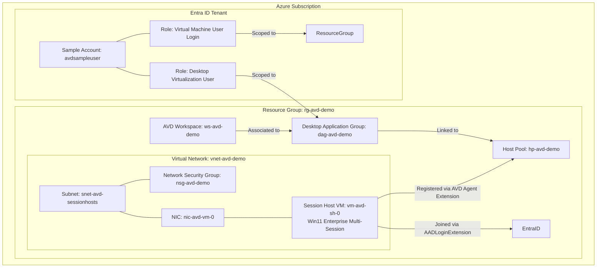

# Azure Virtual Desktop (AVD) End-to-End Terraform IaC Setup

[](https://www.terraform.io/)
[](https://azure.microsoft.com/en-us/products/virtual-desktop/)
[](LICENSE)

An end-to-end Infrastructure as Code (IaC) repository using **Terraform** to provision a complete **Azure Virtual Desktop (AVD)** environment with an **Entra ID (Azure AD)** sample user account, **Session Host VM (Windows 11 Enterprise Multi-Session)**, networking, and RBAC role assignments.

---

## 🏗️ Architecture Overview



---

## 📁 Repository Structure

```text
AVD-setup/
├── main.tf           # Core infrastructure (RG, Hostpool, Workspace, DAG, VNet, Session Host VM, Entra ID User, Roles)
├── variables.tf      # Variable definitions and default values
├── outputs.tf        # Output declarations (Resource IDs, UPN, VM details, Password)
├── providers.tf      # Provider constraints (azurerm v4.x, azuread v2.x, random v3.x)
├── terraform.tfvars  # Environment variable assignment values
├── README.md         # Full project documentation & step-by-step deployment guide
└── .gitignore        # Git ignore file for Terraform state and cache
```

---

## 🚀 Deployed Resources

| Component | Resource Name / Details | Description |
| :--- | :--- | :--- |
| **Resource Group** | `rg-avd-demo` | Azure Resource Group in `eastus` |
| **Host Pool** | `hp-avd-demo` | Pooled AVD Host Pool using `BreadthFirst` load balancing |
| **Workspace** | `ws-avd-demo` | AVD Workspace friendly named `AVD Workspace Demo` |
| **Application Group** | `dag-avd-demo` | Desktop Application Group linked to Host Pool & Workspace |
| **Virtual Network** | `vnet-avd-demo` | `10.0.0.0/16` CIDR block |
| **Subnet & NSG** | `snet-avd-sessionhosts` | `10.0.1.0/24` CIDR block attached to `nsg-avd-demo` |
| **Session Host VM** | `vm-avd-sh-0` | Windows 11 Enterprise Multi-Session (`Standard_D2s_v3`, Private IP `10.0.1.4`) |
| **VM Extensions** | `AADLoginForWindows` & `AVDHostPoolRegistration` | Native Entra ID join & automatic registration with Host Pool |
| **Entra ID Account** | `avdsampleuser@<tenant-domain>` | Sample Entra ID user created dynamically |
| **RBAC Roles** | `Desktop Virtualization User` & `Virtual Machine User Login` | Assigned to sample account for seamless authentication |

---

## 📋 Prerequisites

Before deploying, ensure you have:

1. **Azure Subscription** with permissions to create Resource Groups, Virtual Machines, and Role Assignments.
2. **Azure CLI** installed (`az --version >= 2.50.0`).
3. **Terraform CLI** installed (`terraform >= 1.5.0`).
4. **Entra ID (Azure AD)** permissions to create user accounts.

---

## 🔧 Step-by-Step Deployment Guide

### 1. Clone the Repository
```bash
git clone https://github.com/YOUR_USERNAME/AVD-setup.git
cd AVD-setup
```

### 2. Log in to Azure
```bash
az login
```
*If you have multiple subscriptions, select your target subscription:*
```bash
az account set --subscription "YOUR_SUBSCRIPTION_ID_OR_NAME"
```

### 3. Initialize Terraform
Initialize the working directory and install the required providers (`azurerm`, `azuread`, `random`):
```bash
terraform init
```

### 4. Review the Execution Plan
```bash
terraform plan
```

### 5. Apply the Infrastructure
Deploy all resources to Azure:
```bash
terraform apply -auto-approve
```

---

## 🔑 Accessing AVD as an End User

Once `terraform apply` finishes:

### 1. Retrieve Sample Account Password
Run the following command to retrieve the auto-generated password:
```powershell
terraform output -raw sample_user_password
```

### 2. Connect via Web Browser
1. Navigate to the AVD Web Client:
   👉 **[https://client.wvd.microsoft.com/arm/webclient/index.html](https://client.wvd.microsoft.com/arm/webclient/index.html)**
2. Log in using the output credentials:
   - **Username**: `avdsampleuser@<your-tenant-domain>`
   - **Password**: *(Retrieved from `terraform output`)*
3. Double-click the **Session Desktop** icon under **AVD Workspace Demo** to start your cloud desktop session!

### 3. Connect via Windows Remote Desktop App
1. Download the [Remote Desktop Client for Windows](https://learn.microsoft.com/azure/virtual-desktop/users/connect-windows?pivots=remote-desktop-msrdc).
2. Click **Subscribe** and sign in with the sample user credentials.
3. Launch your virtual desktop.

---

## 🧹 Cleanup / Teardown

To delete all deployed resources and prevent ongoing charges:

```bash
terraform destroy -auto-approve
```

---

## 🔐 Security & Best Practices

- **Sensitive Password Handling**: Passwords are generated using HashiCorp `random_password` and kept marked as `sensitive` in Terraform state.
- **Entra ID Join**: Session Hosts use `AADLoginForWindows` extension for cloud-native authentication without requiring legacy Active Directory Domain Services (AD DS).
- **Least Privilege RBAC**: Access is strictly controlled via `Desktop Virtualization User` on the Application Group and `Virtual Machine User Login` on the Resource Group.

---

## 📄 License
This project is licensed under the MIT License - see the [LICENSE](LICENSE) file for details.
